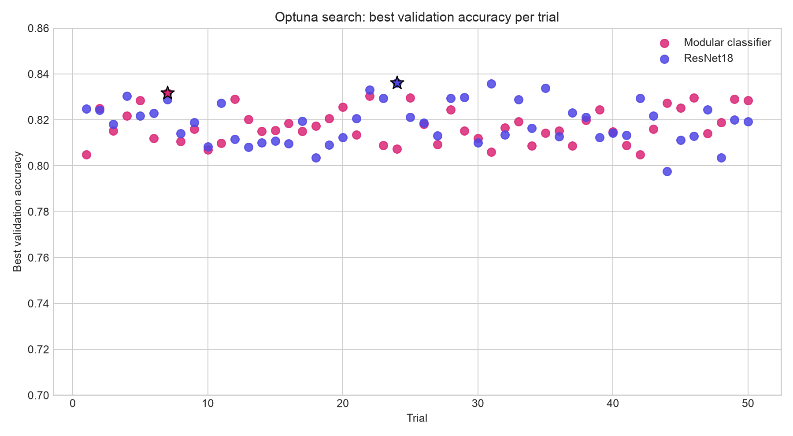
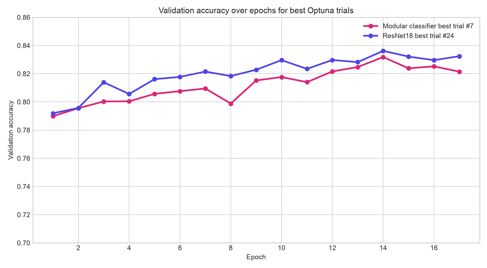
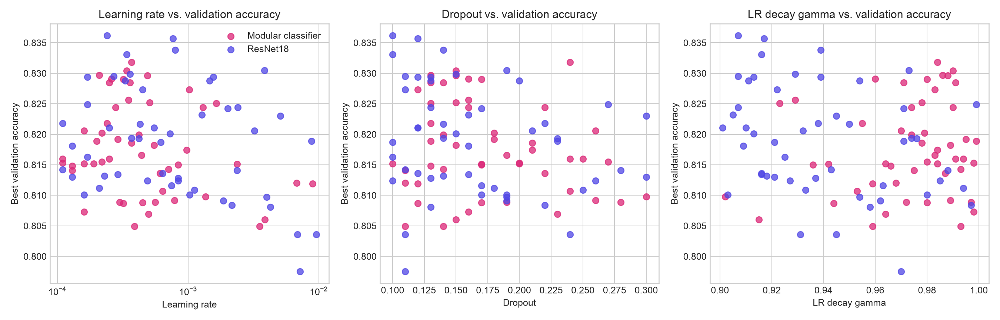

# EMNIST Deep Learning Showcase

[](https://github.com/ScDomi/emnist-deep-learning-showcase/actions/workflows/ci.yml)

A portfolio-ready PyTorch project for handwritten character recognition on the official EMNIST Balanced dataset.

The repo is a cleaned-up, reproducible version of my ML2 deep-learning project: raw notebook/coursework structure out, clear package + CLI + reports in.

## Highlights

- Official dataset via `torchvision.datasets.EMNIST(split="balanced")`
- Transfer learning with ResNet18, ResNet50, EfficientNet-B0 and ConvNeXt-Tiny
- Optional modular classifier: character head + coarse digit/uppercase/lowercase routing head
- Balanced train/validation/test datasets built from official EMNIST splits
- Augmentation, AdamW, label smoothing, LR scheduling, early stopping and CUDA mixed precision
- Optuna hyperparameter tuning across 50-trial studies
- CLI-based training instead of notebook-only execution
- Saved report artifacts: class-distribution plots, confusion matrices, HPO curves and model comparison notes

## Results from the original ML2 run

| Model | Accuracy | R² (historical) |
|---|---:|---:|
| EfficientNet-B0 | 0.8115 | 0.5015 |
| ResNet50 | 0.8359 | 0.5578 |
| ResNet18 | 0.8341 | 0.5550 |
| Modular classifier | 0.8289 | 0.5497 |

Note: this is a classification project, so Accuracy and Macro-F1 are the primary metrics. R² is kept only because it was part of the original university submission comparison.

## Hyperparameter tuning

The specific parameters in this project come from Optuna search runs, not hand-wavy guessing. I tuned learning rate, batch size, dropout and exponential LR decay, then reused the best search outputs for final training.

| Model | Best val accuracy during HPO | Learning rate | Batch size | Dropout | LR decay |
|---|---:|---:|---:|---:|---:|
| ResNet18 | 0.8362 | 0.0002355648 | 32 | 0.1000649470 | 0.9068206566 |
| Modular ResNet18 | 0.8318 | 0.0003737883 | 128 | 0.2404434196 | 0.9836439484 |

The full HPO summary and generated CSVs are in [`reports/hpo/`](reports/hpo/).

## Example artifacts

The repo includes generated artifacts from the original experiment under `reports/figures/`:

- Class distribution before/after balancing
- ResNet18 confusion matrix
- Modular classifier confusion matrix
- Optuna search and parameter-sensitivity plots

### Optuna search overview



### Best trial learning curves



### Hyperparameter sensitivity



## Repository structure

```text
emnist-deep-learning-showcase/
  src/emnist_dl/          # Dataset, model, training and CLI code
  tests/                  # Lightweight model smoke tests
  reports/                # Result notes, HPO CSVs and figures
  configs/                # Reproducible experiment configs
  .github/workflows/      # CI checks
```

## Setup

Use Python 3.10-3.13. PyTorch wheels may not be available for newer Python versions immediately after release.

```bash
python3.11 -m venv .venv
source .venv/bin/activate
pip install -e '.[dev]'
```

## Quick smoke run

```bash
emnist-train --smoke --no-pretrained --batch-size 32 --output-dir outputs/smoke
```

## Full training examples

```bash
emnist-train --model resnet18 --epochs 30 --batch-size 32 --lr 0.0002355648237093861 --dropout 0.10006494702016773 --output-dir outputs/resnet18
```

```bash
emnist-train --model resnet18 --modular --epochs 30 --batch-size 128 --lr 0.00037378831750922145 --dropout 0.24044341963473287 --output-dir outputs/modular-resnet18
```

Each run writes:

- `metrics.json`
- `confusion_matrix.png`
- model weights as `.pt`

## Design choices

- EMNIST data is downloaded at runtime and excluded from Git.
- Large `.pth` checkpoints from the original run are not committed to keep the repo lightweight.
- The cleaned version favors reproducibility and readable project structure over dumping every experiment artifact.
- The modular model is kept because it shows experimentation beyond a plain pretrained backbone.
- The weirdly precise hyperparameters are intentional: they are copied from the Optuna best-parameter JSON files in `reports/hpo/`.

## Local verification

```bash
python -m py_compile src/emnist_dl/*.py tests/*.py
pytest -q
```

## License

MIT
